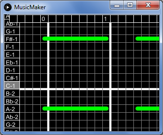

# MusicMaker-Processing
A barebones piano-roll editor with playback and file management utilities. Built with Processing

## Running Music Maker
The files in this repository can be opened, modified, and run on nearly any platform 
with [Processing](processing.org). However, I will try to make releases for Windows and Linux
operating systems.  

## Instructions
### General Instructions:
Use the tab key to change modes.
    1st mode: this help page
    2nd mode: editor
    3rd mode: play panel
Use the 'o' key to open/create a file

### Editor Instructions:
* Use "a","s","d", and "w" keys and mouse drag to scroll.
* To insert a note, press the space bar.
* Keys 1-8 insert a note 1-8 measures long.
* Key 9 inserts a half note, and 0 inserts a quarter note.
* To delete a note, press "q" while the mouse 
    is hovered over one of the enpoints of the line.
* The "r" key opens the repeat dialog
    *Type the number of times the ENTIRE song should repeat
    *When you are done, press the big green button

Your song is saved each time you leave the editor.

### Playback instructions:
Playback will begin imediately after swtitching
    to the play panel. To stop playback, swtich to
    the next mode. 

### File manager instructions:
* Use "a","s","d", and "w" keys to select an option
     in the file loader
* Press the enter key accept your choice
* If the "new file" option was selected, type the
     new file name.
* File names support the following:
    * Lowercase and uppercase letters
    * Numbers
    * The dash and the underscore
